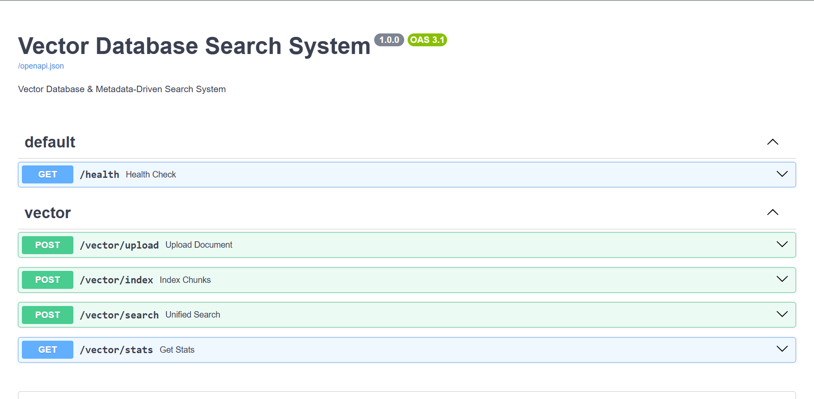

# Vector Database & Metadata-Driven Search System

A production-ready vector database system that stores document embeddings along with rich metadata, supports multiple search patterns, and provides low-latency retrieval using FastAPI and ChromaDB.



## Objectives

- Strong understanding of vector databases and embeddings
- Ability to model metadata-rich embeddings
- Knowledge of search optimization and time complexity
- Clean backend architecture with API, Service, and Repository layers
- Practical FastAPI integration with comprehensive error handling

## Features

### Core Capabilities

1. **Document Chunking** - Configurable text chunking with overlap
2. **Embedding Generation** - Sentence-level embeddings using state-of-the-art models
3. **Vector Storage** - Persistent vector database with Chroma
4. **Multiple Search Strategies**:
   - Semantic Search (vector similarity)
   - Metadata-Filtered Search
   - Hybrid Search (vector + metadata combined)
5. **Rich Metadata Support** - Source, page number, chunk index, timestamps, and tags
6. **Production-Ready** - Docker support, error handling, logging, and health checks

## Architecture

### System Design

```
┌─────────────────────────────────────────────────────────────────┐
│                        FastAPI Server                           │
├─────────────────────────────────────────────────────────────────┤
│  API Layer (routes.py)                                          │
│  - /vector/index          POST                                  │
│  - /vector/search/        POST                                  │
│  - /vector/stats          GET                                   │
├─────────────────────────────────────────────────────────────────┤
│  Service Layer (vector_service.py)                              │
│  - VectorService (orchestration)                                │
│  - ChunkingService (text splitting)                             │
│  - EmbeddingService (sentence-transformers)                     │
├─────────────────────────────────────────────────────────────────┤
│  Repository Layer (vector_repo.py)                              │
│  - VectorRepository (Chroma integration)                        │
│  - Semantic search, Metadata search, Hybrid search              │
├─────────────────────────────────────────────────────────────────┤
│  Data Layer                                                     │
│  - Chroma Vector DB (persistent storage)                        │
│  - HNSW Index (Hierarchical Navigable Small World)              │
│  - DuckDB + Parquet Backend                                     │
└─────────────────────────────────────────────────────────────────┘
```

### Layered Architecture

**API Layer** (`app/api/routes.py`)
- FastAPI endpoint handlers
- Request validation and error handling
- Response formatting

**Service Layer** (`app/services/`)
- Business logic orchestration
- Chunking operations
- Embedding generation
- Search execution

**Repository Layer** (`app/repository/vector_repo.py`)
- Direct Chroma integration
- Index management
- Query optimization
- Metadata filtering logic

**Models** (`app/models/schemas.py`)
- Pydantic data models
- Request/response schemas
- Type safety and validation

## Technical Details

### Vector Data Model

Each chunk stored in the vector database contains:

```python
{
    "chunk_id": "doc_001_chunk_0",           # Unique identifier
    "document_id": "doc_001",                 # Parent document
    "user_id": "u1",                    # Document owner
    "content": "...",                         # Text content
    "embedding": [...],                       # Vector (384 dims)
    "metadata": {
        "source": "pdf",                      # Source type: ocr|pdf|image
        "page_number": 1,                     # Page number
        "chunk_index": 0,                     # Position in document
        "created_at": "2026-01-15T...",      # ISO timestamp
        "tags": ["invoice", "financial"]     # Categorization
    }
}
```

### Chunking Strategy

**Semantic Chunking** - Intelligent chunking based on sentence embeddings and semantic similarity.

**Algorithm**:
1. Split text at sentence boundaries (., !, ?)
2. Generate embeddings for each sentence
3. Calculate cosine similarity between consecutive sentences
4. Group sentences together when similarity ≥ threshold (0.5)
5. Create new chunk when similarity drops or size limit reached

**Configuration**:
- **Target Chunk Size**: 1000 characters (soft limit)
- **Similarity Threshold**: 0.5 (cosine similarity)
- **Overlap**: None (semantic boundaries are natural)
- **Time Complexity**: O(n * e) where n = text length, e = embedding time per sentence

**Benefits**:
- Chunks respect natural language boundaries
- Semantically related content stays together
- Better context preservation for retrieval
- No arbitrary mid-sentence cuts
- More meaningful search results
- Improved retrieval accuracy

**Example**:
```
Text: "Invoice #12345 dated Jan 15. The total amount is $500. 
       Payment is due within 30 days. Late fees may apply."

Chunk 1 (high similarity):
  "Invoice #12345 dated Jan 15. The total amount is $500."
  → Financial transaction details (semantically coherent)

Chunk 2 (similarity dropped):
  "Payment is due within 30 days. Late fees may apply."
  → Payment terms (different semantic topic)
```

**vs. Fixed-Size Chunking**:
- Fixed: May split mid-sentence, losing context
- Semantic: Preserves complete thoughts and semantic units
- Fixed: Requires overlap to maintain context
- Semantic: Natural boundaries eliminate need for overlap

### Embedding Model

**Model**: `sentence-transformers/all-MiniLM-L6-v2`
- **Dimension**: 384
- **Type**: Semantic embeddings
- **Optimized for**: Sentence-level semantic similarity
- **Size**: ~33 MB
- **Speed**: ~5000 sentences/sec on CPU

### Search Mechanisms

#### 1. Semantic Search

**Algorithm**: Vector Similarity (Cosine Distance)
- Query text → embedding → k-NN search
- Distance metric: Cosine (HNSW index optimized for cosine)
- Time Complexity: O(log n) average with HNSW
- Space Complexity: O(n * d) where n=chunks, d=dimension(384)

```python
POST /vector/search
{
    "query": "invoice amount",
    "top_k": 5
}
```

#### 2. Metadata-Filtered Search

**Algorithm**: Index-based filtering
- No vector computation
- Direct metadata matching using DuckDB
- Time Complexity: O(m) where m = total chunks
- Supports filters: source, page_number, tags, document_id, user_id

```python
POST /vector/search
{
    "filters": {
        "source": "pdf",
        "page_number": 1,
        "tags": ["invoice"]
    },
    "top_k": 5
}
```

#### 3. Hybrid Search

**Algorithm**: Weighted combination
- Vector search (weight_vector: 0.7) + Metadata matching (0.3)
- Combined Score = (similarity_score * weight_vector) + (metadata_match * (1 - weight_vector))
- Time Complexity: O(log n + m) where n=chunks, m=filtered results
- More precise results by combining both approaches

```python
POST /vector/search
{
    "query": "invoice amount",
    "filters": {
        "source": "pdf",
        "tags": ["invoice"]
    },
    "top_k": 5,
    "weight_vector": 0.7
}
```

### Vector Index Details

**Index Type**: HNSW (Hierarchical Navigable Small World)
- Approximate Nearest Neighbor (ANN) search
- Excellent balance between speed and accuracy
- Memory-efficient for large datasets
- Built-in to Chroma

**Why HNSW?**
- Time Complexity: O(log n) average query time
- Space Complexity: O(n * d) for storing embeddings
- Better than exhaustive search O(n) for large n
- Trades small accuracy loss for massive speed gain (1000x+ faster)

**Configuration**:
- Space: cosine (normalized dot product)
- Automatically manages index hierarchy
- No manual tuning needed

## Getting Started

### Prerequisites

- Python 3.11+
- Docker (optional)
- 4GB+ RAM (recommended)

### Local Installation

1. **Create virtual environment**:
```bash
python3.11 -m venv venv
.\venv\Scripts\activate  # Windows
source venv/bin/activate  # Linux/Mac
```

2. **Install dependencies**:
```bash
pip install -r requirements.txt
```

3. **Run the server**:
```bash
uvicorn app.main:app --reload --host 0.0.0.0 --port 8000
```

4. **Access API**:
- Swagger UI: http://localhost:8000/docs
- ReDoc: http://localhost:8000/redoc
- Health: http://localhost:8000/health

### Docker Deployment

**Build and run**:
```bash
docker-compose up --build
```

**Access**:
- API: http://localhost:8000
- Swagger: http://localhost:8000/docs

**Persistence**:
- Chroma database stored in `./chroma_db` volume
- Persists across container restarts
- Mount to external storage: `-v /external/path:/app/chroma_db`

## API Endpoints

### 1. POST `/vector/upload`

**Upload and automatically index a document** (PDF, Image, or Text file).

**Request** (multipart/form-data):
- `file`: Document file (required)
- `user_id`: User ID who owns the document (required)
- `tags`: Comma-separated tags (optional, e.g., "invoice,financial")

**cURL Example**:
```bash
curl -X POST "http://localhost:8000/vector/upload" \
  -F "file=@invoice.pdf" \
  -F "user_id=u1" \
  -F "tags=invoice,financial"
```

**Response**:
```json
{
    "chunk_ids": ["doc_a1b2c3d4e5f6_p1_c0", "doc_a1b2c3d4e5f6_p1_c1", "..."],
    "chunks":[],
    "document_id": "doc_a1b2c3d4e5f6",
    "extraction_time_ms": 450.5,
    "filename": "invoice.pdf",
    "message": "Document 'invoice.pdf' uploaded and indexed successfully",
    "source": "pdf",
    "status": "success",
    "total_chunks": 12,
    "total_pages": 3,
    "user_id": "u1",
}
```

**Supported File Types**:
- PDF (.pdf) - text extraction
- Images (.jpg, .jpeg, .png, .bmp, .tiff, .gif) - OCR with Tesseract
- Text files (.txt)

**Limits**:
- Max file size: 10MB
- Automatic text extraction and chunking

---

### 2. POST `/vector/index`

Index document chunks into the vector database.

**Request**:
```json
{
    "chunks": [
        {
            "chunk_id": "chunk_001",
            "content": "Invoice #12345 Amount: $500.00",
            "document_id": "doc_001",
            "metadata": {
                "chunk_index": 0,
                "created_at": "2026-01-15T10:30:00",
                "page_number": 1,
                "source": "pdf",
                "tags": ["invoice", "financial"]
            },
            "user_id" : "u1"
        }
    ]
}
```

**Response**:
```json
{
    "status": "success",
    "message": "Successfully indexed 1 chunks",
    "chunks_indexed": 1,
    "first_chunk_id": "chunk_001"
}
```

### 3. POST `/vector/search`

Perform **semantic** similarity search.

**Request**:
```json
{
    "query": "What is the invoice amount?",
    "top_k": 5
}
```

**Response**:
```json
{
    "results": [
        {
            "chunk_id": "chunk_001",
            "document_id": "doc_001",
            "user_id": "u1",
            "content": "Invoice #12345 Amount: $500.00",
            "metadata": {
                "source": "pdf",
                "page_number": 1,
                "chunk_index": 0,
                "created_at": "2026-01-15T10:30:00",
                "tags": ["invoice", "financial"]
            },
            "similarity_score": 0.9234
        }
    ],
    "total_results": 1,
    "query_time_ms": 45.2
}
```

### 4. POST `/vector/search`

Filter documents by **metadata** without vector search.

**Request**:
```json
{
    "filters": {
        "source": "pdf",
        "page_number": 1,
        "tags": ["invoice"],
        "user_id": "u1"
    },
    "top_k": 10
}
```

**Response**:
```json
{
    "results": [...],
    "total_results": 3,
    "query_time_ms": 12.5
}
```

### 5. POST `/vector/search`

Combine **vector similarity with metadata filtering**.

**Request**:
```json
{
    "query": "invoice payment",
    "filters": {
        "source": "pdf",
        "tags": ["invoice"]
    },
    "top_k": 5,
    "weight_vector": 0.7
}
```

**Response**:
```json
{
    "results": [...],
    "total_results": 5,
    "query_time_ms": 58.3
}
```

### 6. GET `/vector/stats`

Get vector database statistics.

**Response**:
```json
{
    "total_chunks": 150,
    "total_documents": 10,
    "total_users": 5,
    "collection_name": "document_chunks",
    "embedding_dimension": 384,
    "chunk_size": 1000,
    "chunk_overlap": 0,
    "embedding_model": "sentence-transformers/all-MiniLM-L6-v2"
}
```

## Configuration

Edit `.env` to customize:

```env
# Application
APP_NAME=Vector Database Search System
DEBUG=True

# Server
HOST=0.0.0.0
PORT=8000

# Vector Database
CHROMA_PERSIST_DIRECTORY=./chroma_db
COLLECTION_NAME=document_chunks

# Embedding Model
EMBEDDING_MODEL=sentence-transformers/all-MiniLM-L6-v2
EMBEDDING_DIMENSION=384

# Chunking
CHUNK_SIZE=1000      # Target chunk size for semantic chunking (soft limit)
CHUNK_OVERLAP=0      # Not used in semantic chunking
SEMANTIC_SIMILARITY_THRESHOLD=0.5  # Threshold for grouping sentences
```

## Performance Analysis

### Query Performance

**Semantic Search**:
- Average latency: 40-100ms (depends on dataset size)
- Query complexity: O(log n) with HNSW
- Linear scan baseline: O(n) ~1000x slower

**Metadata Search**:
- Average latency: 10-30ms
- Query complexity: O(m) where m = filtered results
- No vector computation

**Hybrid Search**:
- Average latency: 50-120ms
- Query complexity: O(log n + m)
- Overhead of combining results: ~5-10ms

### Memory Usage

- Index overhead: ~50 bytes per chunk
- Metadata storage: ~200 bytes per chunk
- Total for 1M chunks: ~250 MB (efficient)

### Scalability Characteristics

| Metric | Value | Notes |
|--------|-------|-------|
| Chunks per document | Unlimited | Depends on text size |
| Documents per user | Unlimited | Configurable DB size |
| Query latency | O(log n) | With HNSW index |
| Memory per chunk | ~250 bytes | Including metadata |
| Max chunks | Billions | Limited by storage |

## Error Handling

All endpoints return proper HTTP status codes:

- **200 OK**: Successful request
- **400 Bad Request**: Invalid input (empty query, invalid filters)
- **500 Internal Server Error**: Server-side issues

**Error Response**:
```json
{
    "error": "Invalid request",
    "detail": "Query cannot be empty"
}
```

### Handled Errors

- Empty query strings
- Invalid metadata filters
- Dimension mismatch errors
- Missing embeddings
- Uninitialized index
- Connection failures

## Project Structure

```
├── app/
│   ├── api/
│   │   ├── __init__.py
│   │   └── routes.py              # FastAPI endpoints
│   ├── core/
│   │   ├── __init__.py
│   │   └── config.py              # Settings and configuration
│   ├── models/
│   │   ├── __init__.py
│   │   └── schemas.py             # Pydantic models
│   ├── repository/
│   │   ├── __init__.py
│   │   └── vector_repo.py         # Chroma integration
│   ├── services/
│   │   ├── __init__.py
│   │   ├── chunking_service.py    # Text chunking
│   │   ├── embedding_service.py   # Embeddings
│   │   └── vector_service.py      # Business logic
│   ├── __init__.py
│   └── main.py                    # FastAPI app
├── Dockerfile                     # Docker image
├── docker-compose.yml             # Docker Compose config
├── requirements.txt               # Python dependencies
├── .env                          # Environment variables
├── .gitignore                    # Git ignore patterns
└── README.md                     # This file
```

## Learning Outcomes

### Vector Databases
- embedding spaces and semantic search
- HNSW indexing algorithm
- Trade-offs between accuracy and speed
- Metadata filtering strategies

### Backend Architecture
- Separation of concerns (API, Service, Repository)
- Dependency injection patterns
- Error handling best practices
- Logging and monitoring

### Search Systems
- Vector similarity algorithms
- Metadata filtering
- Hybrid search combining multiple strategies
- Time complexity analysis

### Production Systems
- Docker containerization
- Configuration management
- Health checks and monitoring
- Persistent storage design

## Security Considerations

- Input validation on all endpoints
- SQL injection prevention (using Chroma's safe API)
- CORS enabled (adjust `allow_origins` for production)
- No authentication layer (add as needed)
- Logging for audit trails

## Performance Optimization Tips

1. **Adjust similarity threshold** - Lower threshold (0.3-0.4) creates larger chunks, higher (0.6-0.7) creates smaller focused chunks
2. **Use smaller target chunk size** for faster query latency but more chunks to index
3. **Use metadata filters** to reduce vector search space
4. **Batch indexing** for multiple documents
5. **Monitor sentence parsing** - Complex documents may need custom sentence splitting rules

## Troubleshooting

**Vector index not persisting**:
- Check that `chroma_db` volume is properly mounted
- Verify `CHROMA_PERSIST_DIRECTORY` matches volume mount point

**Slow queries**:
- Increase `chunk_size` for fewer total chunks
- Use metadata filters to narrow search space
- Check available system RAM

**OOM errors**:
- Reduce batch size during indexing
- Use smaller embedding model
- Increase available memory

## Example Usage

### Full Workflow

```python
import requests

BASE_URL = "http://localhost:8000"

# 1. Index a document
doc = {
    "chunks": [
        {
            "chunk_id": "invoice_1_0",
            "document_id": "invoice_1",
            "user_id": "user_1",
            "content": "Invoice #INV-001\nDate: 2026-01-15\nAmount: $1500.00\nClient: Acme Corp",
            "metadata": {
                "source": "pdf",
                "page_number": 1,
                "chunk_index": 0,
                "created_at": "2026-01-15T10:30:00",
                "tags": ["invoice", "financial", "2026"]
            }
        }
    ]
}

response = requests.post(f"{BASE_URL}/vector/index", json=doc)
print(response.json())

# 2. Semantic search
search = {
    "query": "What is the invoice amount?",
    "top_k": 3
}

results = requests.post(f"{BASE_URL}/vector/search/semantic", json=search)
print(results.json())

# 3. Metadata search
filters = {
    "filters": {
        "source": "pdf",
        "tags": ["invoice"]
    },
    "top_k": 5
}

results = requests.post(f"{BASE_URL}/vector/search/metadata", json=filters)
print(results.json())

# 4. Hybrid search
hybrid = {
    "query": "financial transaction",
    "filters": {
        "source": "pdf",
        "tags": ["financial"]
    },
    "top_k": 5,
    "weight_vector": 0.6
}

results = requests.post(f"{BASE_URL}/vector/search/hybrid", json=hybrid)
print(results.json())

# 5. Get statistics
stats = requests.get(f"{BASE_URL}/vector/stats")
print(stats.json())
```

## References

- [Chroma Documentation](https://docs.trychroma.com/)
- [Sentence Transformers](https://www.sbert.net/)
- [HNSW Algorithm Paper](https://arxiv.org/abs/1603.09320)
- [FastAPI Documentation](https://fastapi.tiangolo.com/)

## License

MIT License - feel free to use in your projects